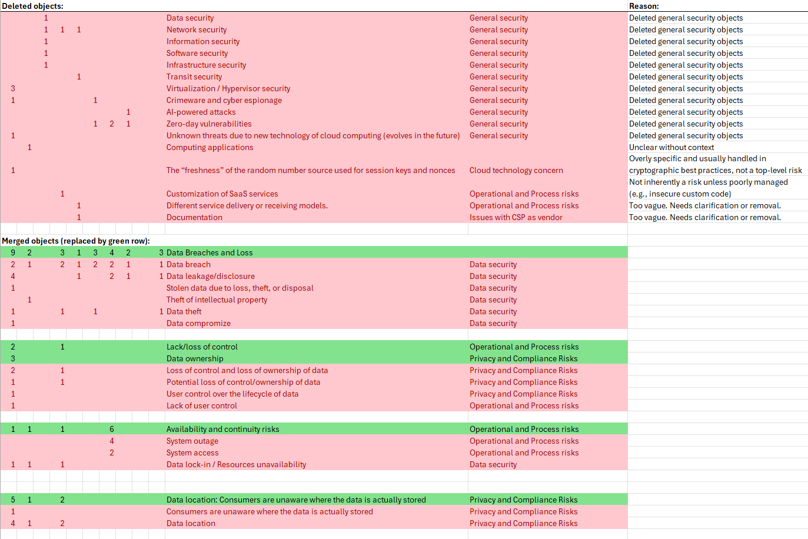

This file contains information on the CSV files
- rawExtractedData.csv
- threatLandscape.csv
- concernLandscape.csv

---

# `rawExtractedData.csv`

This file contains the raw extracted data objects.

Objects with the prefix `raw_` contain information from the stated sources, as it is mentioned there.

Objects with the prefix `edited_` contain edited information on the object that was elaborated in the data synthesis step.

Information on the fields:

- ExtractedObjectId
- SourceType: Can have the following values: Publication (Scientific publication), Report (Organizational report)
- Source: Is an id that represents the following sources.
	- Marinescu2023: Dan C. Marinescu. Cloud computing. Morgan Kaufmann Publishers, an imprint of Elsevier, Cambridge, MA, third edition edition, 2023. Includes bibliographical references and index.
	- Bharti2024: Juvi Bharti and Sarpreet Singh. A Review on Security Vulnerabilities in Cloud Computing, pages 229–247. Springer Nature Singapore, 2024.
	- Amalarethinam2024: D. I. George Amalarethinam and J. Vinnarasi. A Survey of Challenges Associated with Cloud Computing Security, pages 470–483. Springer Nature Switzerland, 2024.
	- Surianarayanan2023: Chellammal Surianarayanan and Pethuru Raj Chelliah. Integration of the internet of things and cloud: Security challenges and solutions – a review. International Journal of Cloud Applications and Computing, 13(1):1–30, July 2023.
	- Humayun2022: Mamoona Humayun, Mahmood Niazi, Maram Fahhad Almufareh, N. Z. Jhanjhi, Sajjad Mahmood, and Mohammad Alshayeb. Software-as-a-service security challenges and best practices: A multivocal literature review. Applied Sciences, 12(8):3953, April 2022.
	- Wali2024: Arwa Wali and Fatimah Alshehry. A survey of security challenges in cloudbased scada systems. Computers, 13(4):97, April 2024.
	- CSA2024: Cloud Security Alliance. Top threats to cloud computing 2024. August 2024. https://cloudsecurityalliance.org/artifacts/topthreats-to-cloud-computing-2024 (accessed: 30.10.2024).
	- PaloAlto2024: Palo Alto Networks. 2024 state of cloud-native security report. 2024. https://www.paloaltonetworks.com/resources/research/state-of-cloud-native-security-2024 (accessed: 08.06.2025).
	- CrowdStrike2023: Crowdstrike. 2023 cloud risk report: The rise of the cloud-conscious adversary. 2023. https://www.crowdstrike.com/resources/reports/crowdstrike-2023-cloud-risk-report-executive-summary/ (accessed: 30.10.2024).
	- SentinelOne2024: Sentinel One. 2024 cloud security report. 2024. https://www.sentinelone.com/resources/2024-cloud-securityreport-sentinelone/ (accessed: 08.06.2025).
- raw_Object: Object is the extracted information object. It can be a concern, or threat.
- raw_CategoryofObjects: Category of the object.
- raw_IsThreat: Boolean value that indicates, whether the object is mentioned explicitly as threat.
- raw_IsAttack: Boolean value that indicates, whether the object is mentioned explicitly as attack.
- raw_IsVulnerability: Boolean value that indicates, whether the object is mentioned explicitly as vulnerability.
- raw_WideSecurityRelatedTerm: Wider security-related term that is used explicitly to describe the object.
- raw_CIAField: Explicitly mentioned CIA field of the object.
- raw_IaaS: Boolean value that indicates, whether the object is mentioned explicitly to be associated with IaaS.
- raw_PaaS: Boolean value that indicates, whether the object is mentioned explicitly to be associated with PaaS.
- raw_SaaS: Boolean value that indicates, whether the object is mentioned explicitly to be associated with SaaS.
- raw_CloudComponent: Explicitly mentioned cloud component to which the object is relevant.
- raw_Rank: Information on the rank in relation to other threats and concerns.
- raw_Comment: Comment of the author of the thesis on the object that may be relevant for classification.
- raw_MentionedSourceOfInformation (other than literature): The mentioned information source of the object, e.g. a survey of user experience, or threat intelligence report. Information sources from other publications are were not extracted.
- raw_Reference (C - chapter, P - page): Reference to the chapter or page of the source that mentions the object.
- edited_Object: Renamed object as it is present in the synthesized threat landscape data.
- edited_IsConcern: Boolean value that indicates, whether the object is classified as concern. Concern is the term that comprises all wider security-relevant terms other than threat, attack, and vulnerability. E.g. risk, issue, challenge, concern.
- edited_IsThreat: Boolean value that indicates, whether the object is classified as threat.
- edited_IsAttack: Boolean value that indicates, whether the object is classified as attack.
- edited_IsVulnerability: Boolean value that indicates, whether the object is classified as vulnerability.
- edited_ForCSPExclusively: Boolean value that indicates, whether the object lies fully within the responsibility of the Cloud Service Provider.
- NumberAddedToThreatsTable: Numerical value that contains the number of objects that have been inserted out of this object to the threat landscape data table. E.g. 2 means that the object was split into two objects that are present in the synthesized threat landscape data.
- NumberAddedToConcernsTable: Numerical value that contains the number of objects that have been inserted out of this object to the concern landscape data table. E.g. 2 means that the object was split into two objects that are present in the synthesized concern landscape data.

# `threatLandscape.csv`

This file contains the threat landscape objects. The data represents the synthesized cloud threat objects as result of the SLR procedure. 

Information on the fields:

- Fields that indicate the source in which the object is mentioned. A counter represents the number how often the object is mentioned:
	- Counter: Marinescu2023
	- Counter: Bharti2024
	- Counter: Amalarethinam2024
	- Counter: Surianarayanan2023
	- Counter: Humayun2022
	- Counter: Wali2024
	- Counter: CSA2024
	- Counter: PaloAlto2024
	- Counter: CrowdStrike2023
	- Counter: SentinelOne2024
- Summarizing fields of the source counter values:
	- Counter Sum: Pub1: Non-distinct count. Probably multiple times in each publication (not including elements of sub-objects)
	- Counter Sum: Pub2: Distinct count of publication counts. One time per publication where it was mentioned (not including elements of sub-objects)
	- Counter Sum: Report1: Non-distinct count. Probably multiple times in each report.
	- Counter Sum: Report2: Distinct count of reports. One time per report where it was mentioned
- Category of Objects: Category of the object.
- Object: Threat object.
- Threat: Boolean value that indicates, whether the object is classified as threat.
- Attack: Boolean value that indicates, whether the object is classified as attack.
- Vulnerability: Boolean value that indicates, whether the object is classified as vulnerability.
- Layer in shared responsibility model by CSA: Relevant layer for the object. The layer definition was used from the Cloud Security Alliance report https://cloudsecurityalliance.org/artifacts/security-guidance-v5.
- Is API-related: Boolean value that indicates, whether the object is an API-related threat.
- Boolean values that represent the shared responsibility layers as they are mentioned in field `Layer in shared responsibility model by CSA`.
	- Configuration
	- IAM
	- Data
	- Networking
	- Application
	- Runtime
	- Middleware
	- OS
	- Virtualization
	- Servers
	- Storage
	- Physical Security
- Check: Is in top 3 threat categories (IAM, API-related, Configuration): Boolean value that indicates, whether the object lies within the defined three categories.
- MITRE ATT&CK number
- MITRE ATT&CK name
- Is threat category: Boolean value that indicates, whether the object is a threat category.
- CSP is fully responsible: Boolean value that indicates, whether the object fully lies within the responsibiilty of the Cloud Service Provider.
- No cloud-specific threat: Boolean value that indicates, whether the object is a general threat and not directly related to cloud environments.
- Is malware-type: Boolean value that indicates, whether the object represents a malware type.
- On-Prem: Boolean value that indicates, whether the object is only relevant for non-cloud environments.

# `concernLandscape.csv`

This file contains the concern landscape objects. The data represents the synthesized cloud concern objects as result of the SLR procedure. 

A visual representation of the data is presented in image `concernLandscape.png`

Information on the fields:

- Fields that indicate the source in which the object is mentioned. A counter represents the number how often the object is mentioned:
	- Counter: Marinescu2023
	- Counter: Bharti2024
	- Counter: Amalarethinam2024
	- Counter: Surianarayanan2023
	- Counter: Humayun2022
	- Counter: Wali2023
	- Counter: CSA2024
	- Counter: PaloAlto2024
	- Counter: CrowdStrike2024
	- Counter: SentinelOne2024
- Object: Concern object.
- Main category of concern: Chosen main category in which the object falls.
- Concern categories in which the object falls:
	- C: Regulatory & Legal Compliance
	- C: Data Privacy and Ownership
	- C: System & Operational Failures
	- C: Resource & Service Management
	- C: Accountability & Control
	- C5: Cloud as new technology, and complex nature of cloud
	- C: Data security
	- C: Data management and integrity
	- C: Infrastructure and network security
	- C: Software/Application security
- Impact: Boolean value that indicates, whether the object describes a concern that defines an impact scenario.
- Boolean values that indicates to which CIA field the object is relevant:
	- Confidentiality
	- Integrity
	- Availability

Some concerns have been merged and deleted. The following image contains information on which objects have been merged.

