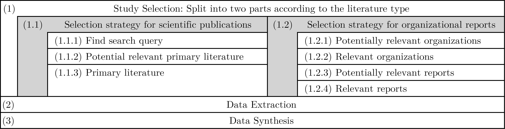

[TOC]

# Review protocol: SLR Threat Landscape

The SLR follows the methodology presented by: 
- Barbara Kitchenham. Guidelines for performing Systematic Literature Reviews in software engineering. EBSE Technical Report EBSE-2007-01. 01 2007.

**Research question:**

- What are existing threats to workloads outsourced to the cloud, ranked by severity?

The SLR process is visualized in Figure 1. The protocol follows roughly these steps.


Figure 1: Schematic representation of the SLR process.

## (1.1) Study Selection Process of Scientific Publications

### Search strategy:

#### Build search query:

1. Preliminary search
   - Reason: Find some papers that contain the required information in order to find/construct useful search terms
      - Methodology: Manual searches in 
        - five relevant resources (Springer Link, IEEE, ACM, CatalogPlus, GoogleScholar)
        - reference lists of found results
        - papers that cite already found results
      - Used search terms: 
        - Various combinations of 
          - cloud-specific terms, security-specific terms, and relevent terms for the specific topic
            - iaas, paas, saas
            - threats, vulnerabilities, issues
            - landscape, overview

2. Trial searches 1 - **Construction of queries**: 
   - Reason: Find search terms that lead to the desired information
   - Methodology: 
     1. select top 3 relevant publications from preliminary search (by subjective assessment) that contain information to the research question of the literature search.
        Reason for restriction to top 3: To narrow down the scope
     2. Second, construct for each publication a query
        Reason: Construct useful queries that lead to the results
   
3. Trial searches 2 - **Generalization of three trial searches (construction of a combined query)**:
   - Reason: This generalization intends to find a universal search query that produces as good search results (that also contain the three results evaluated useful from the preliminary search).
   - Methodology:
     1. Break down results from trials searches 1 into individual facets/categories
     2. Trial searches for combination of three queries from trials searches before.

4. Add synonyms and alternative spellings to query
   - Reason: To find more (possible relevant) publications, the universal query will be extended with synonyms and alternative spellings of existing search terms

#### Build search strategy:

##### Search query (result from previous step):

- List of synonyms, abbreviations, and alternative spellings

  Groups of search terms:

  1. cloud context key words
  2. attacks types and similar key words
  3. current trends and similar key words

  Final Query in a universal (Springer Link) format:

  ```
    ("cloud computing" OR "cloud services" OR "SaaS" OR "Software as a Service" OR "IaaS" OR "Infrastructure as a Service" OR "PaaS" OR "Platform as a Service" OR "cloud security" OR "cloud workloads" OR "outsource to cloud" OR "migrate to cloud" OR "cloud outsourcing")
  AND
    ("attack types" OR "attack techniques" OR "attack methods" OR "attack strategies" OR "security vulnerabilities" OR "security threats" OR "identified threats" OR "identified vulnerabilities")
    AND
  ("current trends" OR "recent trends" OR "ongoing trends" OR "present trends" OR "latest trends" OR "threat landscape" OR "threat overview" OR "vulnerability landscape" OR "vulnerability overview" OR "existing threats" OR "existing vulnerabilities" OR "known threats" OR "known vulnerabilities" OR " " OR "potential threats" OR "security-related concerns" OR "security-related issues" OR "security-related risks" OR "security-related challenges" OR "security concerns" OR "security issues" OR "security risks" OR "security challenges")
  ```

##### Resources  to be searched:

- Three main digital libraries in computer science: Springer Link, IEEE, ACM
- University specific search: TU CatalogPlus
- Google Scholar


### Study selection procedure:

1. **<u>Potentially relevant primary literature</u>** (study selection criteria): 

   - Literature obtained from manual search, and
   - Literature from structured search: The top 10 most relevant results from each resource (after applying the filter criterion) will be considered as primary literature
     - Filtering criterion: 
	     - Studies that contain information that contribute to answering the research question, i.e. they contain information about threats to cloud workloads.
	     - Restrictions:
		     - Years: 2022-2024 (the threat landscape publications older than 2 years may contain outdated information)
		     - Publication types: : Journal (Research article) Magazine, Book, or Book Chapter
	           -> (See notes)

2. **<u>Relevant/Primary literature</u>**: Chosen from *potentially relevant primary literature*

   - Methodology:
     - Potentially relevant primary literature was loaded into JabRef
	     - -> in separate lists according to the digital library that produced the result, along with its rank in the digital library
     - The relevant attributes for each publication was filled out in a Excel table, by
	     - 1 - Read abstract
	     - 2 - Scroll through paper and read headings
	     - 3 - Skimming possibly relevant sections
	     - 4 - Assess quality of the publication
     - Relevant attributes (columns in excel table):
	     - Usability score [1 (low) - 5 (high)]
	     - Publication Year (First indication when the paper was finished)
	     - Entry type (from BibTex - by DOI number)
	     - Quality score [1 (low) - 5 (high)]
	         - See checklist below
	     - Contains relevant Information [TRUE, FALSE]
	     - Amount of relevant information (estimation in pages)
	     - Information sources for RQ-relevant information (e.g. literature, reports, MITRE framework, ...)
	     - Main topic of the publication
	     - Cloud is the object of security informations [TRUE, FALSE]
	         - This correlates with "Contains relevant Information"
	     - Type of mentioned information on security: (Concerns, Challenges, Threats, Attacks, Vulnerabilities, Risks, Pitfalls, ...)
	     - Ranking information [TRUE, FALSE]
	     - Other columns:
	         - Citation key (as reference to entry in bibtex references)
		     - Ranking score in search (per search engine)
	         - Information on incidents [TRUE, FALSE] (maybe relevant later)
	         - Reason for usability decision (notes on usability score)
	         - Final choice [TRUE, FALSE] (whether the publication is considered as primary literature)
     - Filter *relevant primary literature* from list of *potentially relevant primary literature* by the defined selection criteria (see below).
     
- **Selection process / selection criteria** with the number of publications passing each criterion
	- **Potentially relevant literature**: 48 (from manual and automatic search)
	- Check publication type again: 47
	    - Literature selected in manual search was not checked yet.
	- Contain relevant information for RQ [TRUE]: 30
	- Date [>= 2022]: 22
		- Check again, since publication date in journal may be later (Publications are created a certain time before the journal published the publication. Therefore this check is necessary).
	- Amount of relevant information [>= 1 page]: 14
    - Removed publications with very brief and not comprehensive information.
	- Usability score [>= 4]: 6
	- **Relevant literature**: 6

### Study usability and quality assessment checklists and procedures:

- Quality score [1 (low) - 5 (high)]:
	- Quality assessment **checklist** (Indicators that lead to a lower score):
		- Severe amount of typos and other text/structural errors
	    - Figures are not numbered
	    - Figures have poor quality
	    - No mentioned methodology
	- Procedure: Quality score is assessed
		1. with an initial score of 5 (best)
		2. Decrease score according to found issues according to checklists

- Usability score [1 (low) - 5 (high)]:
	- Usability assessment **checklist**:
		- Negative (Issues that lead to a lower score):
			- Contains less information than previously assessed (by a deeper investigation)
			- Topic is not assessed useful for the research question
			- Contains multiple negative quality indicators (see checklist below)
		- Positive (Issues that lead to a higher score):
			- Listed as peer-reviewed article in TU CatalogPlus search
	- Procedure: Usability score is assessed
		1. with an initial score equal to quality score
		2. Increase/decrease according to found issues according to checklists

## (1.2) Study Selection Process of Organizational Reports

### Search strategy:

1. Find organizations that publish reports on the research question.
2. Find most relevant reports

### Select organizations:

1. **<u>Potentially relevant organizations</u>**

   Creating a list of potentially relevant organizations: Consider reports of prominent security organizations:

	- CSA as known relevant organization. It is referenced in various scientific publications.
	- Mentioned Leader Endpoint Protection Platforms (EPP) by Gartner (https://www.gartner.com/doc/reprints?id=1-2IV5W7LE&ct=240920&st=sb)
	- Organization of ART "Red Canary" was included in the set, since their atomic test framework is used in this thesis

   Resulting list of potentially relevant organizations:

	- Cloud Security Alliance (CSA)
	- Leaders in Gartners Magic Quadrant of EPPs:
		- CrowdStrike
		- Microsoft
		- SentinelOne
		- Palo Alto Networks
		- Trend Micro
		- Sophos
	- Red Canary

2. **<u>Relevant organizations</u>**

   Methodology:
	- Get basic information on organization:
		- Brief introduction to organization
		- What reports do they publish?
		- Contain information about cloud security threats?
		- How often are those reports published?
		- How do they collect the data, if stated?
	- Selection criteria
		- Organization that publish reports on cloud threats (contain potential information to the research question)

### Select reports:

1. **<u>Potentially relevant reports</u>** 

   Definition: Reports from relevant organizations (that were selected in the previous step)

2. **<u>Relevant reports</u>**: Chosen from **potentially relevant reports**

	- Report contains information on cloud threats
	- Selection criteria:
		- They do have (their reports do contain) an overview of threats to cloud workloads
		- Report was published between 2022 and 2024 (but only the newest is chosen)

## (2) Data extraction strategy:

(Similar for both publication types)

### Design of Data Extraction Forms:

The data will be extracted by one researcher (student).

The categories of data extracted from each publication (Data Extraction Form):
- Object of interest (e.g. Deployment of rogue or insecure VM)
- Category of object (e.g. VM-based threats)
- Security categories (type of objects of interest):
	- Concrete security-related terms: Threat, attack, and/or vulnerability
	- Wide security-related terms: Challenge, issue, risk, concern, ...
- Cloud categories (corresponding domain of objects of interest):
	- Cloud service model: IaaS, PaaS, SaaS
	- Cloud components: Storage/DB, network, OS, ...
- Data security assurance domain: CIA field
- Ranking information
- Comment
- Mentioned source of information (other than literature)
- Reference (chapter and/or page number)

### Data extraction procedure:

Read literature and do the following:

- Identify the mentioned objects of interest and the category of objects it lies within
- Add it to the corresponding extraction table (excel file) and fill out the form in order to
	- (if existing) Declare the type of the object, 
	- (if existing) the corresponding domain of the object within the cloud environment, 
	- (if existing) other attributes
- Note that for objects of interest only categories are filled out in the data extraction table that are referenced explicitly in the document. E.g. an object is filled out with the attributes vulnerability and integrity (CIA triad component) it it is stated explicitly as integrity-related vulnerability in the document.

**Result**: Raw extraction table.

## (3) Data synthesis strategy:

### Merge/synthesis procedure:

- Create a copy of each table
	- Remove Source and Reference column
	- Clean/revise entries (**this is a cyclic process that was executed multiple times**):
	    - Object: Rename into general name according subjective assessment of already merged entries
	    - Re-evaluate concrete security-related terms. E.g.: If an object is considered as attack, but was not mentioned explicitly as attack in the document, the attribute attack is added.
	    - For all objects that are not threats: Rename wide security-related terms into the more general term concern:
			- Challenge -> Concern
			- Risk -> Concern
			- Aspect -> Concern
			- Issue -> Concern
			- Problem -> Concern
			- Nefarious operation -> Concern
		- Delete (marked as red in extraction tables), when 
			- It is only relevant for the CSP
			- Not considered important for cloud workload security
			- Too general. No real benefit of adding it.
- Add each row to one of the synthesis tables
	- **Table 1: Threats**: Threats, attacks, and vulnerabilities
	- **Table 2: Concerns**: Wider security-related terms that fall not within the threats table
- Procedure for adding: 
	- If it doesn't exists: Add it as new row
	- It it exists: 
	    - Merge objects that are similar into a unified object that fits both and continue with *clean/revise entries* step from before
	    - Increase counter (Counter is a reference and serves as check that each object is contained in the synthesis table)

Result:
- **Synthesis Table 1: Threats**
- **Synthesis Table 2: Concerns**
